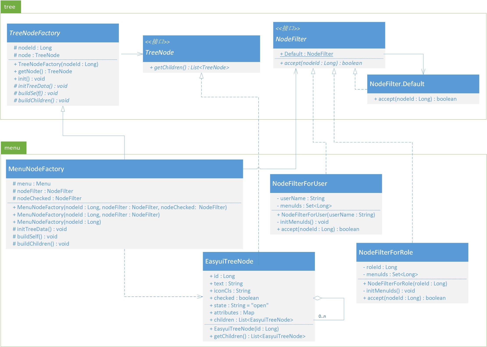

# 菜单实现 #
--------------------



--------------------

#### TreeNodeFactory.java ####

```java

package utils.tree;

/**
 * 树节点生成器。
 * 
 * @author Leo
 * @date 2011-03-16
 * 
 * @param <T>
 */
public abstract class TreeNodeFactory <T extends TreeNode>{
	/**
	 * 节点id。
	 */
	protected Long nodeId;
	/**
	 * 节点。
	 */
	protected T node;
	/**
	 * 获取生成好的节点。
	 */
	public T getNode(){
		return node;
	}
	
	public TreeNodeFactory(Long nodeId){
		this.nodeId = nodeId;
	}
	
	/**
	 * 初始化节点。
	 * @throws TreeException 
	 */
	public void init() throws TreeException{
		initTreeData();
		buildSelf();
		buildChildren();
	}
	
	/**
	 * 初始化数据。
	 * @throws TreeException
	 */
	protected abstract void initTreeData() throws TreeException;
	/**
	 * 构造自身节点。
	 * @throws TreeException
	 */
	protected abstract void buildSelf() throws TreeException;
	/**
	 * 构造子节点。
	 * @throws TreeException
	 */
	protected abstract void buildChildren() throws TreeException;
}
```

#### TreeNode.java ####

```java

package utils.tree;

import java.util.List;

/**
 * 树节点接口。
 * 
 * @author Leo
 * @date 2011-03-16
 */
public interface TreeNode {
	/**
	 * 获取当前节点的子节点，每个节点都可以包含0或多个子节点。
	 * 
	 * @return 子节点列表。
	 */
	List<? extends TreeNode> getChildren();
}
```

#### NodeFilter.java ####

```java
package utils.tree;

/**
 * 节点过滤器接口。
 * <p>
 * <code>NodeFilter</code>的实现类将对节点做进一步控制。
 * 
 * @author Leo
 * @date 2011-03-16
 */
public interface NodeFilter {
	/**
	 * @param nodeId 节点ID。
	 * @return 是否被过滤器接受。
	 */
	boolean accept(Long nodeId);

	/**
	 * 默认过滤器实现。
	 */
	public static class Default implements NodeFilter{
		@Override
		public boolean accept(Long nodeId) {
			return true;
		}
	}
	public static NodeFilter Default = new Default();
}
```

--------------------

#### MenuNodeFactory.java ####

```java

package utils.tree.menu;

import java.util.HashMap;

import models.admin.common.Menu;
import utils.tree.NodeFilter;
import utils.tree.TreeException;
import utils.tree.TreeNodeFactory;
import utils.tree.node.EasyuiTreeNode;

/**
 * 菜单节点生成器。
 * 
 * @author Leo
 * @date 2011-03-16
 */
public class MenuNodeFactory extends TreeNodeFactory<EasyuiTreeNode> {
	protected Menu menu;
	
	protected NodeFilter nodeFilter; // 控制菜单是否显示
	protected NodeFilter nodeChecked; // 控制easyui的tree控件中菜单是否被选中

	/**
	 * 用于管理员进行功能授权时，选择功能的菜单列表的节点生成。
	 */
	public MenuNodeFactory(Long nodeId, NodeFilter nodeFilter, NodeFilter nodeChecked){
		super(nodeId);
		this.nodeFilter = nodeFilter;
		this.nodeChecked = nodeChecked;
	}
	/**
	 * 用于用户登录后，显示用户可用功能的菜单列表的节点生成。
	 */
	public MenuNodeFactory(Long nodeId, NodeFilter nodeFilter) {
		this(nodeId, nodeFilter, NodeFilter.Default);
	}
	/**
	 * 用于超级管理员登录后，显示全部可用功能的菜单列表的节点生成。
	 */
	public MenuNodeFactory(Long nodeId) {
		this(nodeId, NodeFilter.Default, NodeFilter.Default);
	}

	@Override
	protected void initTreeData() throws TreeException {
		// 获取菜单数据
		menu = Menu.findById(this.nodeId);
		if(menu==null){
			throw new TreeException("节点不存在");
		}
		
		// 初始化当前节点数据
		this.node = new EasyuiTreeNode(this.nodeId);
	}
	
	@Override
	protected void buildSelf() throws TreeException {
		// 验证可否访问该节点
		if(this.nodeFilter.accept(this.nodeId)){
			this.node.text = menu.name;
			this.node.iconCls = menu.iconUrl;
			this.node.checked = menu.children.size()==0&&this.nodeChecked.accept(this.nodeId);
			this.node.attributes = new HashMap<String, Object>();
			this.node.attributes.put("url", menu.url);
		}
	}

	@Override
	protected void buildChildren() throws TreeException {
		for(Menu cMenu : menu.children){
			// 添加有访问权限的子菜单
			if(this.nodeFilter.accept(cMenu.id)){
				TreeNodeFactory childFactory = new MenuNodeFactory(cMenu.id, nodeFilter, nodeChecked);
				childFactory.init();
				this.node.children.add((EasyuiTreeNode)childFactory.getNode());
			}
		}
	}	
}
```

#### EasyuiTreeNode.java ####

```java
package utils.tree.node;

import java.util.ArrayList;
import java.util.List;
import java.util.Map;

import utils.tree.TreeNode;

import com.google.gson.annotations.Expose;

/**
 * 用于EasyUI的树节点。
 * 
 * @author Leo
 * @date 2011-03-16
 */
public class EasyuiTreeNode implements TreeNode {
	@Expose
	public Long id;
	@Expose
	public String text;
	@Expose
	public String iconCls;	//图标
	@Expose
	public boolean checked;	//是否选中
	@Expose
	public String state = "open";	//是否展开(open或closed)
	@Expose
	public Map<String, Object> attributes;
	@Expose
	public List<EasyuiTreeNode> children = new ArrayList<EasyuiTreeNode>();

	public EasyuiTreeNode(Long id){
		this.id = id;
	}

	@Override
	public List<EasyuiTreeNode> getChildren() {
		return children;
	}
}
```

#### NodeFilterForUser.java ####

```java
package utils.tree.menu;

import java.util.HashSet;
import java.util.List;
import java.util.Set;

import models.admin.common.Menu;
import utils.tree.NodeFilter;

/**
 * 根据用户判断是否可访问菜单节点。
 * 
 * @author Leo
 * @date 2011-03-16
 */
public class NodeFilterForUser implements NodeFilter {
	private String userName;
	private Set<Long> menuIds;
	public NodeFilterForUser(String userName){
		this.userName = userName;
		initMenuIds();
	}
	
	@Override
	public boolean accept(Long nodeId) {
		return menuIds.contains(nodeId);
	}
	
	// 根据用户取出有权限菜单id
	private void initMenuIds(){
		String hql = "select menu.id " +
	   		"from models.admin.common.Role role " +
	   		"inner join role.users user " +
	   		"inner join role.menus menu " +
	   		"where disabled=false " +
	   		"and user.userName=?";
		List<Long> mids = Menu.find(hql, userName).fetch();
		this.menuIds = new HashSet<Long>(mids);
	}
}
```

#### NodeFilterForRole.java ####

```java
package utils.tree.menu;

import java.util.HashSet;
import java.util.List;
import java.util.Set;

import models.admin.common.Menu;
import utils.tree.NodeFilter;

/**
 * 根据角色判断是否可访问菜单节点。
 * 
 * @author Leo
 * @date 2011-03-16
 */
public class NodeFilterForRole implements NodeFilter {
	private Long roleId;
	private Set<Long> menuIds;
	public NodeFilterForRole(Long roleId){
		this.roleId = roleId;
		initMenuIds();
	}

	@Override
	public boolean accept(Long nodeId) {
		return menuIds.contains(nodeId);
	}
	
	// 根据角色取出相关菜单id
	private void initMenuIds(){
		String hql = "select menu.id " +
	   		"from models.admin.common.Role role " +
	   		"inner join role.menus menu " +
	   		"where disabled=false " +
	   		"and role.id=?";
		List<Long> mids = Menu.find(hql, roleId).fetch();
		this.menuIds = new HashSet<Long>(mids);
	}
}
```